FAQ Возвращения древних
========
1.  Алое пламя дракона

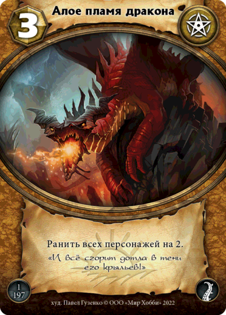

При одновременной гибели существ особенности «гибель» (а также
начинающиеся со слов «когда попадает на кладбище») срабатывают в
выбранном игроком порядке, начиная с неактивного игрока.

2.  Вожак стаи

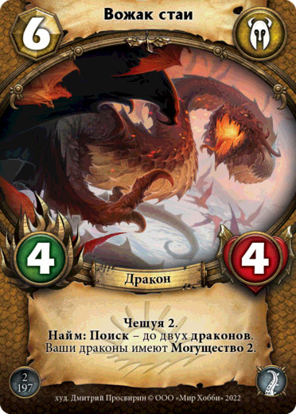

Игрок может отказаться от выполнения **Поиска**, даже если знает, что
искомая карта в колоде имеется. Перемешивания колоды при этом не
происходит.

3.  Грозящий расправой

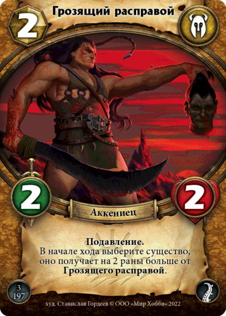

Особенность срабатывает в начале хода каждого игрока.

4.  Зардагор, Кровавый

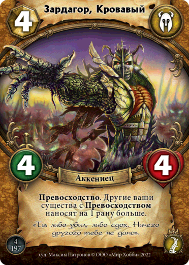

Дополнительные раны наносятся не только тем персонажам, над которыми
имеется **Превосходство**.\
Дополнительные раны подсчитываются вместе с **Превосходством**.

5.  

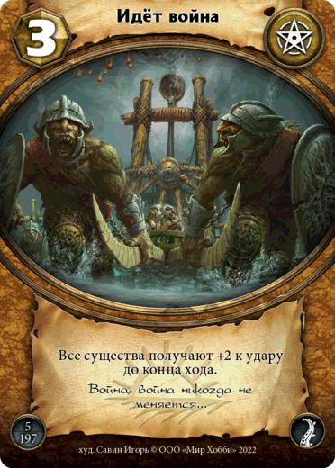

Эффект распространяется на всех существ, включая существ противника.

6.  

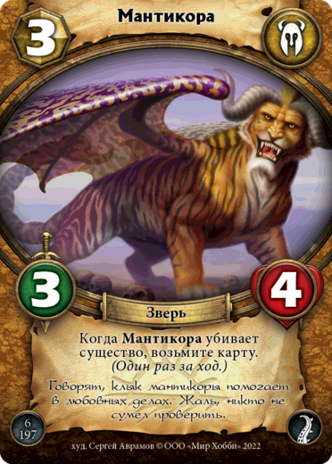

Если выполнилось условие срабатывающей способности, то она добавится в
очередь (и, соответственно, выполнится) вне зависимости от того, где
находится источник способности.

7.  

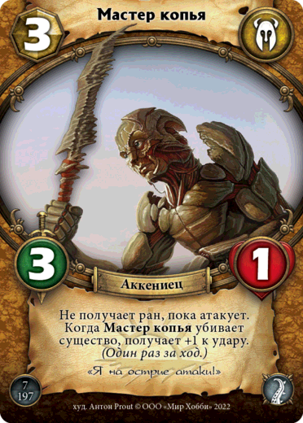

Существо перестаёт быть атакующим после нанесения ран и закрытия
существа.

8. 

 .. image:: ./images/image8.png

Особенность может быть задействована не только **Могуществом**.

9.  

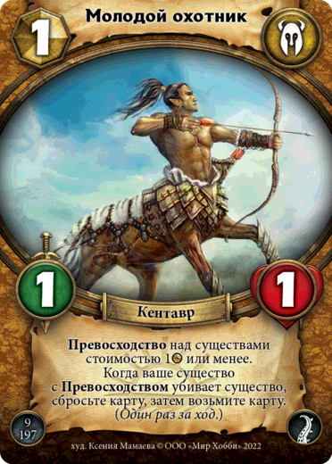

Особенность выполняется настолько, насколько возможно. Карта берётся,
даже если с руки не было сброшено карт.

10. 

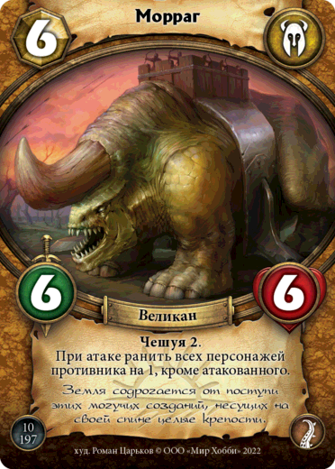

При одновременной гибели существ особенности «гибель» (а также
начинающиеся со слов «когда попадает на кладбище») срабатывают в
выбранном игроком порядке.

11. 

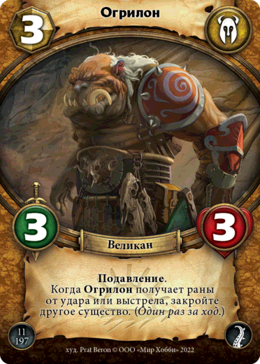

Можно закрыть закрытое существо.\
При отсутствии существ у противника, необходимо выбрать своё существо.

Если выполнилось условие срабатывающей способности, то она добавится в
очередь (и, соответственно, выполнится) вне зависимости от того, где
находится источник способности.

12. 

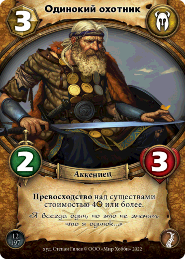

Модификаторы стоимости не относятся к существам на столе.

13. 

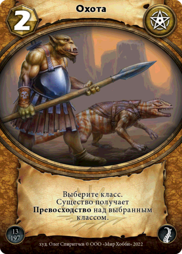

14. 

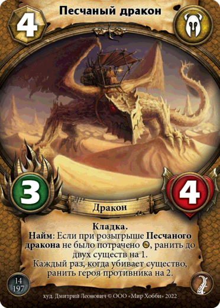

При одновременной гибели существ особенности «гибель» (а также
начинающиеся со слов «когда попадает на кладбище») срабатывают в
выбранном игроком порядке.

15. 

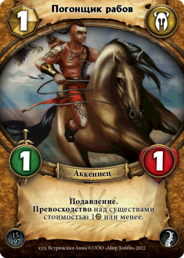

16. 

.. image:: ./images/image16.png)

Особенность срабатывает в конце хода каждого игрока.

При упоминании зоны, по умолчанию, происходит взаимодействие с вашей
зоной.

Для розыгрыша карты необходимо оплатить её стоимость.

17. 

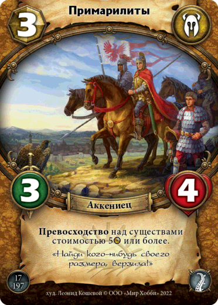

18. 

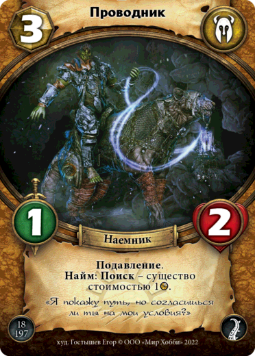

Игрок может отказаться от выполнения **Поиска**, даже если знает, что
искомая карта в колоде имеется. Перемешивания колоды при этом не
происходит.

19. 

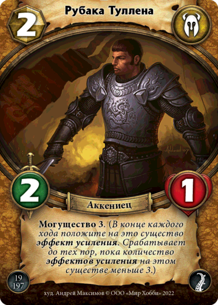

20. 

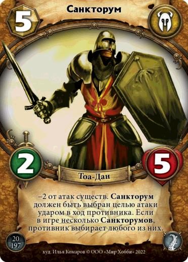

При атаке ударом должен быть выбран противником целью каждой атаки.

21. 

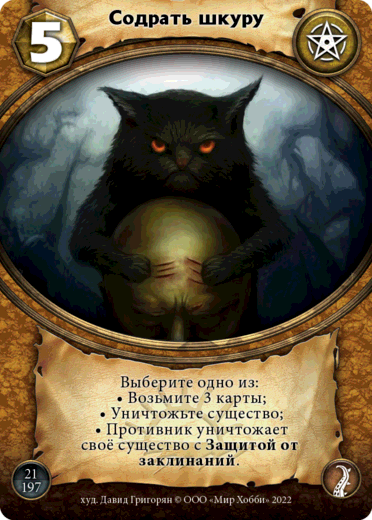

22. 

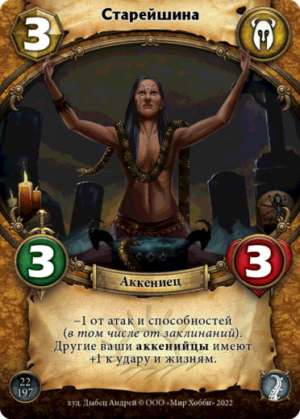

Особенность не предотвращает раны от **Ярости**.

23. 

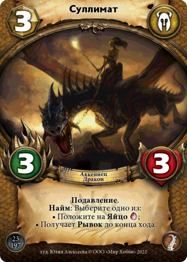
24. 

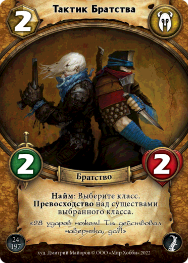

25. 

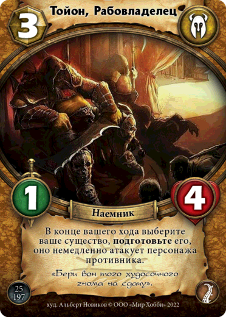

Существо, вышедшее в этот ход, не сможет атаковать, если не имеет
**Рывок**.

26. 

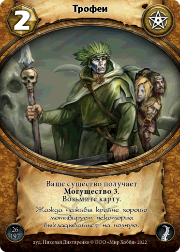

27. 

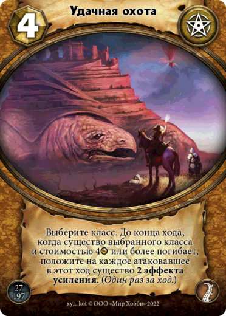

28.

 .. image:: ./images/image28.png

29. 

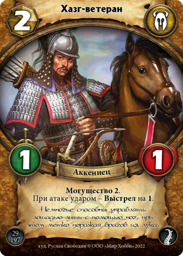

**Выстрел** считается атакой.

Если выполнилось условие срабатывающей способности, то она добавится в
очередь (и, соответственно, выполнится) вне зависимости от того, где
находится источник способности.

30. 

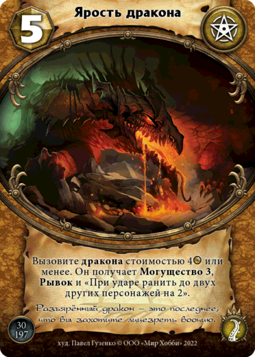

Игрок может отказаться от выполнения **Вызова**, даже если знает, что
искомая карта в колоде имеется. Перемешивания колоды при этом не
происходит.

При одновременной гибели существ особенности «гибель» (а также
начинающиеся со слов «когда попадает на кладбище») срабатывают в
выбранном игроком порядке.
