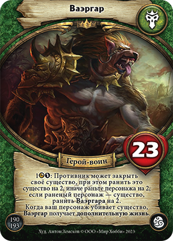
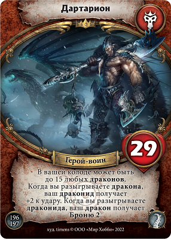
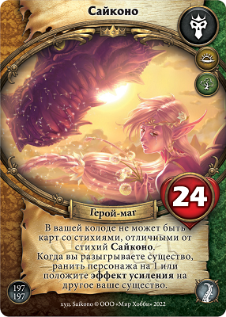
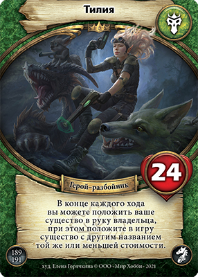

FAQ по картам "Герой"
=====================
Герой — это персонификация игрока. Герой всегда лежит в открытую в игровой зоне своего владельца, пока продолжается игра. Игрок проигрывает, когда его герой получает суммарное количество ран, равное его количеству жизней (или превышающее это значение).

Ваэгар
--------  

1: Противник может закрыть своё существо, при этом ранить это существо на 2, иначе раньте персонажа на 2;
если раненый персонаж – существо, ранить Ваэргара на 2.
Когда ваш персонаж убивает существо, Ваэргар получает дополнительную жизнь. 

.. admonition:: Комьюнити FAQ
  
  Если противник закрыл своё существо и ранил его, Ваэргар получает 2 раны.
  Закрыть закрытае существо нельзя, потому что это часть Оплаты.

Дартарион
--------  

В вашей колоде может быть до 15 любых драконов.
Когда вы разыгрываете дракона, ваш драконид получает +2 к удару. Когда вы разыгрываете драконида, ваш дракон получает Броню 2.

.. admonition:: Комьюнити FAQ
  
  В колоде и доп. колоде могут содержаться карты 15 любых драконов.

Сайконо
--------

В вашей колоде не может быть карт, отличных от стихий Сайконо.
Когда вы разыгрываете существо, ранить персонажа на 1 или положите эффект усиления на другое ваше существо.

.. admonition:: Комьюнити FAQ
  
  В колоде и доп. колоде могут содержаться карты только стихии Степь и Лес
  
Тилия
-----

В конце каждого хода вы можете положить ваше существо в руку владельца, при этом положите в игру существо с другим названием той же или меньшей стоимости.
  
.. admonition:: Комьюнити FAQ
  
  Особенность работает в конце хода каждого игрока.
  Вы можете вернуть свое существо и при этом не обязаны положить подходящее существо в игру (даже если оно у вас есть/даже если противник знает, что оно у вас есть)
