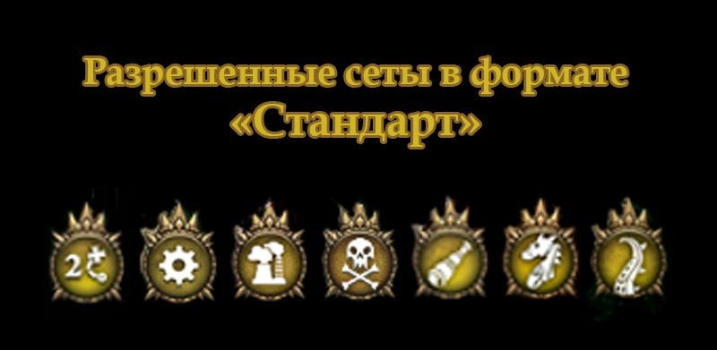

Турнирные правила
============
Общие правила
--------------
- Колода должна содержать от 40 карт и Героя.
- В колоде не может быть более трёх одинаковых карт.
- Карты в колоде должны быть той же стихии, что и герой (или нейтральными)

Стандартный формат
------
Актуальные выпуски:

- «Расцвет технологий» + «Цена прогресса»

- «Черные паруса» + «Новые земли»

- «Пробуждение драконов» и «Возвращение Древних»

Дополнительно легальны Герои из выпуска «Летние приключения 2018».

.. admonition:: Баны
  Леод, командор
  Циркут
  Орочий таран

Вечный формат:
-------------
Легальны карты любых выпусков, за исключением списка запрещенных карт.

.. admonition:: Баны

  Медиум
  Лики судьбы
  Торментор

Генерал: 
--------

60 карт в колоде, все карты должны быть уникальны, не считая карт “Орды”. 

Вы можете использовать карты из любых выпусков, ротации в формате нет. 

Одной из необычных фишек формата является то, что вы можете блокировать атаки любых существ, даже если атака идёт не по вам, что придаст особый интерес в дипломатической части игры.  

.. admonition:: Баны
  Торментор
  Карави
